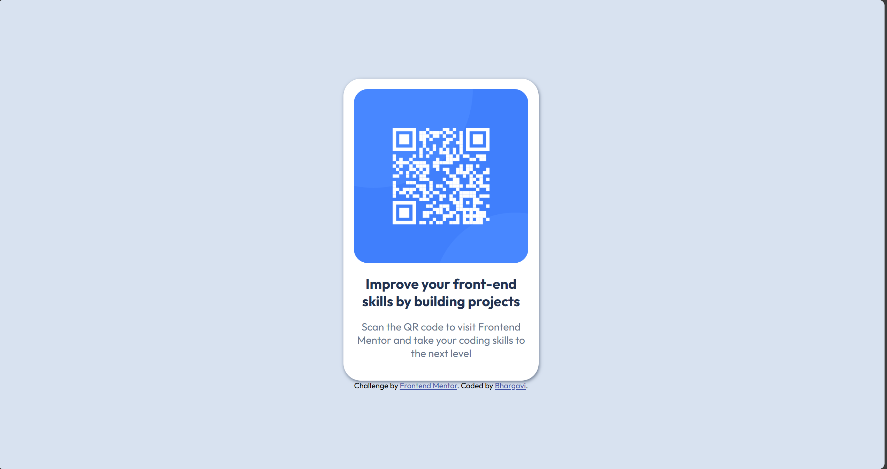

# Frontend Mentor - QR Code Component Solution

This is my solution to the [QR code component challenge on Frontend Mentor](https://www.frontendmentor.io/challenges/qr-code-component-iux_sIO_H). This challenge helped me improve my HTML and CSS layout skills by building a clean, responsive card design.

## 📋 Table of Contents

- [Overview](#overview)
  - [Screenshot](#screenshot)
  - [Links](#links)
- [My Process](#my-process)
  - [Built With](#built-with)
  - [What I Learned](#what-i-learned)
  - [Continued Development](#continued-development)
  - [Useful Resources](#useful-resources)
- [Author](#author)

---

## 📌 Overview

### 🖼️ Screenshot



---

### 🔗 Links

- Solution URL: [GitHub Repo](https://github.com/NallaBhargavi25/https://github.com/NallaBhargavi25/Responsive-QR-code-card-using-HTML-CSS/tree/main)
- Live Site URL: [Live Preview](https://nallabhargavi25.github.io/qr-code-component/)

---

## 🔨 My Process

### 🧱 Built With

- Semantic HTML5
- CSS3
- Flexbox
- Mobile-first responsive design
- Google Fonts – *Outfit*
- Vanilla Web Development (No frameworks)

---

### 💡 What I Learned

- How to center content perfectly using Flexbox.
- Creating clean UI components with rounded corners and box shadows.
- Using `@media` queries to handle small screen sizes.
- Font pairing and color scheme alignment with design systems.

#### Example Snippet:

```css
body {
  display: flex;
  justify-content: center;
  align-items: center;
  height: 100vh;
  background-color: hsl(212, 45%, 89%);
}
.card {
  background-color: white;
  border-radius: 25px;
  box-shadow: 1px 2px 5px hsl(216, 15%, 48%);
}
```

---

### 🔄 Continued Development

- Practice using CSS Grid for layout as an alternative to Flexbox.
- Add dark mode toggle feature for better accessibility.
- Work on making components modular and reusable in future projects.

---

### 📚 Useful Resources

- [MDN Web Docs – Flexbox](https://developer.mozilla.org/en-US/docs/Web/CSS/CSS_Flexible_Box_Layout)
- [Frontend Mentor – Help Center](https://www.frontendmentor.io/resources)
- [CSS Tricks – Box Shadow Guide](https://css-tricks.com/almanac/properties/b/box-shadow/)

---

## 👩‍💻 Author

- Frontend Mentor: [@NallaBhargavi25](https://www.frontendmentor.io/profile/NallaBhargavi25)
- GitHub: [NallaBhargavi25](https://github.com/NallaBhargavi25)
- LinkedIn: [Bhargavi Nalla](https://www.linkedin.com/in/bhargavi-nalla-78a183290)

---

## 🙌 Acknowledgments

Thanks to [Frontend Mentor](https://www.frontendmentor.io/) for creating such well-structured, beginner-friendly challenges that build real-world skills.
